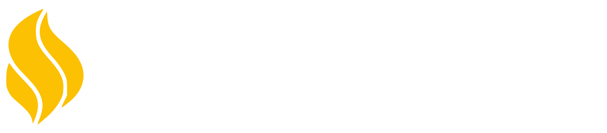

------

# ArbeitLinkers

ArbeitLinkers is a platform designed to provide numerous amenities to individuals seeking remote work opportunities in the global market. It also serves as a platform for organizations to search for creative talent to fulfill their needs. Users can easily register or log in to the website to access remote work opportunities or post their own work. The platform features an advanced search bar that allows users to filter results based on their specific needs or skills. Additionally, ArbeitLinkers facilitates bidding on work between users and organizations, with payment options including credit card, debit card, net banking, and UPI systems. Users can also provide valuable feedback about their experience on the platform.

## Introduction

ArbeitLinkers is a Laravel-based platform that connects remote workers with organizations seeking creative talent. Created by Avadh Rakholiya, Darshan Dhanani, Akash Alagiya, and Gautam Savsaviya, this platform offers a seamless experience for both users and organizations.

## Features

- User registration and login
- Posting and searching for remote work opportunities
- Advanced search functionality
- Bidding mechanism for work contracts
- Multiple payment options including credit card, debit card, net banking, and UPI systems
- Feedback system for users
- Admin dashboard for managing users and platform activities
- Blog section for sharing user and organization work experiences
- Page analytics to track user engagement
- Contact dashboard for generating reports on user interests
- Payment dashboard for tracking total income from completed works

## Installation

To set up ArbeitLinkers locally, follow these steps:

1. Clone the repository: `https://github.com/darshan-1611-dev/arbeit-linkers-app.git`
2. Navigate to the project directory: `cd arbeit-linkers-app`
3. Install dependencies: `composer install`
4. Copy the `.env.example` file to `.env` and configure your environment variables
5. Generate an application key: `php artisan key:generate`
6. Migrate the database: `php artisan migrate`
7. Seed the database (optional): `php artisan db:seed`
8. Start the Laravel server: `php artisan serve`

## Usage

To use ArbeitLinkers, simply navigate to the website and register or log in. Once logged in, users can browse available remote work opportunities, use the advanced search bar to find specific jobs, bid on contracts, and provide feedback on their experience.

## Contributing

Contributions to ArbeitLinkers are welcome! If you'd like to contribute, please fork the repository, make your changes, and submit a pull request. Be sure to follow the project's coding standards and guidelines.

---